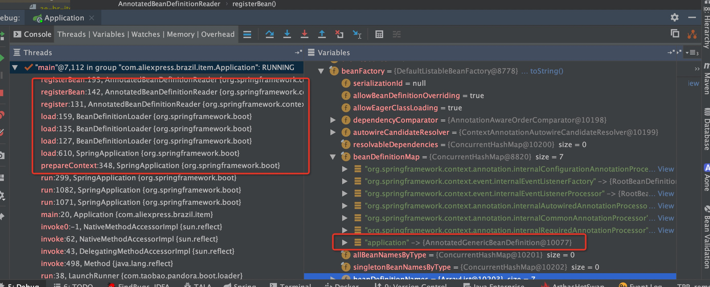

# SpringBoot启动流程源码分析

首先提出几个问题

* AutoConfiguration是如何做到的？
* @Configuration是如何工作的？
* @Autowire、@Value的属性是何时赋值的？能在构造函数里使用么？
* @Transactional、@Cachable 注解是如何工作的？

本文旨在走读SpringBoot启动流程源码，记录其中的关键节点，特别是业务开发过程中值得注意的点，一方面可以更好的理解SpringBoot的工作原理，一方面可以避免在日常开发中踩坑。


## 启动入口 SpringApplication.run

分析源码，首先要找到启动入口，SpringBoot应用启动入口即为SpringApplication#run静态方法：

```
@SpringBootApplication(scanBasePackages = {"com.xxx.yyy"})
public class Application {
    public static void main(String[] args) {
    		// 启动入口
        SpringApplication.run(Application.class, args);
    }
}
```

 继续跟踪run方法，发现2个关键节点：SpringApplication构造函数和run方法。

### SpringApplication构造函数

```
public SpringApplication(Object... sources) {
		initialize(sources);
}

private void initialize(Object[] sources) {
		if (sources != null && sources.length > 0) {
			this.sources.addAll(Arrays.asList(sources));
		}
		this.webEnvironment = deduceWebEnvironment();
		
		// 底层通过调用 SpringFactoriesLoader.loadFactoryNames 加载spring.factories中配置的 
		// ApplicationContextInitializer和ApplicationListener实现类，并通过反射构造instance
		setInitializers((Collection) getSpringFactoriesInstances(ApplicationContextInitializer.class));
		setListeners((Collection) getSpringFactoriesInstances(ApplicationListener.class));
		
		this.mainApplicationClass = deduceMainApplicationClass();
}
```

构造函数中比较核心的关键点在于初识工具方法 SpringFactoriesLoader#loadFactoryNames

```
/**
 * 使用ClassLoader 加载所有 META-INF/spring.factories 文件，解析其格式，最后返回所有实现类名称List
 * spring.factories文件格式为：interfaceName=concreteClass1,concreteClass2,concreteClass3...
 */
public static List<String> loadFactoryNames(Class<?> factoryClass, ClassLoader classLoader) {
		String factoryClassName = factoryClass.getName();
		try {
		  // public static final String FACTORIES_RESOURCE_LOCATION = "META-INF/spring.factories";
			Enumeration<URL> urls = (classLoader != null ? classLoader.getResources(FACTORIES_RESOURCE_LOCATION) :
					ClassLoader.getSystemResources(FACTORIES_RESOURCE_LOCATION));
			List<String> result = new ArrayList<String>();
			while (urls.hasMoreElements()) {
				URL url = urls.nextElement();
				Properties properties = PropertiesLoaderUtils.loadProperties(new UrlResource(url));
				String propertyValue = properties.getProperty(factoryClassName);
				for (String factoryName : StringUtils.commaDelimitedListToStringArray(propertyValue)) {
					result.add(factoryName.trim());
				}
			}
			return result;
		}
		catch (IOException ex) {
			throw new IllegalArgumentException("Unable to load factories from location [" +
					FACTORIES_RESOURCE_LOCATION + "]", ex);
		}
	}

```

构造函数执行完后的SpringApplication，设置了initializers和listeners，这些属性非常重要，会完成一些重要工作。比如 ConfigFileApplicationListener，在接收到 ApplicationEnvironmentPreparedEvent 时，会处理 spring.profiles.active多环境配置。


### SpringApplication.run（核心初始化方法）

```
# 省略一些无关紧要的初始化代码以及try-catch
public ConfigurableApplicationContext run(String... args) {
	  ApplicationArguments applicationArguments = new DefaultApplicationArguments(args);
		ConfigurableEnvironment environment = prepareEnvironment(listeners, applicationArguments);
		Banner printedBanner = printBanner(environment);
		context = createApplicationContext();
		analyzers = new FailureAnalyzers(context);
		prepareContext(context, environment, listeners, applicationArguments, printedBanner);
		refreshContext(context);
		afterRefresh(context, applicationArguments);
		listeners.finished(context, null);
		stopWatch.stop();
		if (this.logStartupInfo) {
			new StartupInfoLogger(this.mainApplicationClass).logStarted(getApplicationLog(), stopWatch);
		}
		return context;
	}
```


#### prepareEnvironment

主要工作为

* new StandardServletEnvironment()，初始化propertySources、propertyResolver、activeProfiles={},defaultProfiles={"default"}，初始化完的Environment propertySources属性来源主要有4个：

```
0. servletConfigInitParams
1. servletContextInitParams
2. systemProperties, 从System.getProperties()获取，系统属性，比如file.separator java.version，包括-D指定的一些属性。
3. systemEnvironment, 从System.getenv()获取，系统环境变量，比如JAVA_HOME CLASSPATH 这些在~/.bash_profile设置的变量。
```

* 通过 EventPublishingRunListener#environmentPrepared，发布 ApplicationEnvironmentPreparedEvent，会触发一个比较重要的ConfigFileApplicationListener#onApplicationEnvironmentPreparedEvent方法执行。

  ```
  经过这一步，propertySources新增了2个来源：
  0. servletConfigInitParams
  1. servletContextInitParams
  2. systemProperties
  3. systemEnvironment
  4. random：估计Spring内部使用的，无需关心
  5. ConfigFileApplicationListener$ConfigurationPropertySources   来自application.properties配置文件
  ```

#### 

####createApplicationContext

创建ApplicationContext，其类型是 AnnotationConfigEmbeddedWebApplicationContext。

```
// new AnnotationConfigEmbeddedWebApplicationContext();
public AnnotationConfigEmbeddedWebApplicationContext() {
		this.reader = new AnnotatedBeanDefinitionReader(this);
		this.scanner = new ClassPathBeanDefinitionScanner(this);
}

// new AnnotatedBeanDefinitionReader(this); 
这个构造函数向容器中注入了6个重要的基础 beanDefinition，广泛意义上都可以称为PostProcess，是在BeanFactory或者Bean实例化之后得到回调，进而完成一些工作。
1. ConfigurationClassPostProcessor, 是一个BeanDefinitionRegistryPostProcessor, 处理@Configuration
2. AutowiredAnnotationBeanPostProcessor, 是一个 InstantiationAwareBeanPostProcessor, 处理@Autowired和@Value
3. RequiredAnnotationBeanPostProcessor, 是一个InstantiationAwareBeanPostProcessor, 处理@Required
4. CommonAnnotationBeanPostProcessor, 是一个InstantiationAwareBeanPostProcessor,  JSR-250 support, 处理@Resource @PostConstruct @PreDestory
5. EventListenerMethodProcessor, 是一个SmartInitializingSingleton，用于处理@EventListener。
6. DefaultEventListenerFactory, 是一个EventListenerFactory, 与EventListenerMethodProcessor配置，用于创建ApplicationListener。

// new ClassPathBeanDefinitionScanner(this);
这个构造函数，创建了一个ClassPathBeanDefinitionScanner，默认的includeFilters=@Component
```


####prepareContext

准备Context，实则完成一些初始化操作，主要包括：

* 调用Initializers
* 创建BeanDefinitionLoader
* 注册主配置类（启动类Application）：beanName=application，
* 将SpringApplication的listener复制到ApplicationContext中、发布ApplicationPreparedEvent

```
// 调用Initializers。
applyInitializers(context);

// 创建BeanDefinitionLoader；将主配置类注册到BeanFactory
load(context, sources.toArray(new Object[sources.size()]));

// 将SpringApplication的listener复制到ApplicationContext中。发布ApplicationPreparedEvent。
// 上述两个功能，都是通过这个 EventPublishingRunListener 完成的。
listeners.contextLoaded(context);
```



#### refreshContext

大名鼎鼎的刷新容器，Spring的核心步骤，SpringBoot之前就已存在，具体实现为：AbstractApplicationContext#refresh。其核心主要包括如下几步：

* prepareRefresh：设置了一些标志位，无重要的关键点。

* prepareBeanFactory：

  * 注册BeanPostProcessor： ApplicationContextAwareProcessor
  * 注册BeanPostProcessor： ApplicationListenerDetector
  * 注册Bean：environment=StandardServletEnvironment
  * 注册Bean：systemProperties=System.getProperties()
  * 注册Bean：systemEnvironment=System.getenv()

* postProcessBeanFactory：注册了一个BeanPostProcessor：WebApplicationContextServletContextAwareProcessor

* invokeBeanFactoryPostProcessors：Spring提供的重要扩展点之一，可以在BeanFactory创建完，Bean实例化之前做一些工作。实例化所有类型为BeanFactoryPostProcess的先Bean，再依次调用bean的钩子方法，Bean扫描就是在这一步完成的，具体完成Bean扫描的为这个BeanFactoryPostProcessor：ConfigurationClassPostProcessor#postProcessBeanDefinitionRegistry

  

* registerBeanPostProcessors

  获取容器中Type为BeanPostProcess的beanName列表，调用Beanfactory#getBean方法提前初始化这些Bean，并将这些Bean存入BeanFactory的beanPostProcessors属性中。

  

* registerListeners

* finishBeanFactoryInitialization：初始化所有的单实例Bean

  * createBean：构造函数实例化Bean

  * populateBean：初始化Bean属性，包括 @Autowired和@Value的处理

  * BeanPostProcessor#before：before钩子

  * invokeInitMethods：各种init方法，init-method、@PostConstruct 、InitializationBean

  * BeanPostProcessor#after：after钩子

    

####自动配置的工作原理

重点在于 @EnableAutoConfiguration，其又包含一个元注解：@Import(EnableAutoConfigurationImportSelector.class)。真正干活的就是这个 EnableAutoConfigurationImportSelector，它会从 spring.factories中读取所有的  EnableAutoConfiguration 的实现类，Spring会将这些实现类，以单例模式注册到自己的容器中。

所有的 @Enablexxx模式，基本都是这个套路，包含一个元注解 @Import(xxxxxx)，真正干活的其实是这个xxxxx。

```
// EnableAutoConfigurationImportSelector#selectImports，返回一个类名数据，Spring容器会创建这些类的单例，注册到容器中
@Override
public String[] selectImports(AnnotationMetadata annotationMetadata) {
    if (!isEnabled(annotationMetadata)) {
        return NO_IMPORTS;
    }
    try {
        AutoConfigurationMetadata autoConfigurationMetadata = AutoConfigurationMetadataLoader
                .loadMetadata(this.beanClassLoader);
        AnnotationAttributes attributes = getAttributes(annotationMetadata);
        List<String> configurations = getCandidateConfigurations(annotationMetadata, attributes);
        configurations = removeDuplicates(configurations);
        configurations = sort(configurations, autoConfigurationMetadata);
        Set<String> exclusions = getExclusions(annotationMetadata, attributes);
        checkExcludedClasses(configurations, exclusions);
        configurations.removeAll(exclusions);
        configurations = filter(configurations, autoConfigurationMetadata);
        fireAutoConfigurationImportEvents(configurations, exclusions);
        return configurations.toArray(new String[configurations.size()]);
    }
    catch (IOException ex) {
        throw new IllegalStateException(ex);
    }
}
```


####  ConfigFileApplicationListener

ConfigFileApplicationListener是一个ApplicationListener，完成了一些值得注意的工作：

* 从spring.factories中加载并执行 EnvironmentPostProcessor
* 从spring.factories中加载 PropertySourceLoader，用于加载 applicaiton.properties 文件
* 处理 spring.profiles.active 

##### 加载并执行 EnvironmentPostProcessor

```
// 可以实现自己的EnvironmentPostProcessor，添加一些自定义配置逻辑
// DiamondEnvironmentPostProcessor 即是一个自定义的EnvironmentPostProcessor，实现了优先从diamond取配置的逻辑,
// 然后再从application.properties文件中读取配置，从而实现分机房配置。
private void onApplicationEnvironmentPreparedEvent(ApplicationEnvironmentPreparedEvent event) {
		List<EnvironmentPostProcessor> postProcessors = loadPostProcessors();
		postProcessors.add(this);
		AnnotationAwareOrderComparator.sort(postProcessors);
		for (EnvironmentPostProcessor postProcessor : postProcessors) {
			postProcessor.postProcessEnvironment(event.getEnvironment(), event.getSpringApplication());
		}
	}

// 从 spring.factories 中加载 EnvironmentPostProcessor 实现类
List<EnvironmentPostProcessor> loadPostProcessors() {
		return SpringFactoriesLoader.loadFactories(EnvironmentPostProcessor.class, getClass().getClassLoader());
}

```

#####PropertySourceLoader


##### 处理spring.profiles.active 

具体处理的细节代码非常绕，无论是看类名还是方法名，读起来根本想不到它是处理Profile的。

这么重要的功能藏得太深，而且是通过反射设置的，阅读起来日了狗，这一块个人感觉写的是非常烂。

我们可以简单的理解为，解析application.properties文件，匹配到 spring.profiles.active属性，设置到Environment.activeProfiles中，再解析application-xxx.properties

```
// ConfigFileApplicationListener#bindSpringProfiles
// 读取application.properties，过滤其中以spring.profiles开头的属性，最终设置到Environment中的activeProfiles中
private SpringProfiles bindSpringProfiles(PropertySources propertySources) {
			SpringProfiles springProfiles = new SpringProfiles();
			RelaxedDataBinder dataBinder = new RelaxedDataBinder(springProfiles, "spring.profiles");
			// 经过dataBinder.bind，会初始化springProfiles中的active和include属性
			dataBinder.bind(new PropertySourcesPropertyValues(propertySources, false));
			springProfiles.setActive(resolvePlaceholders(springProfiles.getActive()));
			springProfiles.setInclude(resolvePlaceholders(springProfiles.getInclude()));
			return springProfiles;
}
```


##### Bean扫描原理

普通的Bean扫描比较简单，简化后的版本就是通过ClassLoader#getResouces加载文件（从basePackage下），然后将文件流通过ASM解析得到类的所有元信息，然后判断此类是否有@Component注解。

上述可以完成类文件的加载和Bean注册，如果都是普通的Service、Controller的话，那就完事了。但是现在SpringBoot都是基于配置类的方式替代了XML，有些类文件承载了配置文件的作用（至少有一个主启动类Application），解析的起始点就是配置类Applicaiton，解析是一个递归的过程（具体实现为：org.springframework.context.annotation.ConfigurationClassParser#processConfigurationClass），第一阶段解析过程如下：

* 解析@Conditional，看是否应该注册此Bean（比如@ConditionalOnProperty就是在这一步执行）。
* 解析内部类，看内部类是否应该注册为Spring Bean，如果是，递归解析内部类。
* 解析 @PropertySource。
* 解析 @ComponentScan：
  * 扫描指定package下的所有类，标注了@Component的作为候选者（扫描到的AutoConfiguration会被排除），创建对应的BeanDefinition。
  * 解析候选者标注的@lazy、@Primary、@DependsOn，设置到BeanDefinition的对应属性中。
  * 对每一个BeanDefinition，如果容器中不存在，注册到容器中。

* 对上述每一个真正注册到容器中的BeanDefinition，重复上述过程，直到找不到标注了@ComponentScan的候选者。


经过第一阶段，扫描出所有标注了@Component的Bean，因为有些Bean是起配置作用的Bean，所以对每一个Bean还要做进一步解析（第二阶段）：

* 解析 @Import：具体方法为ConfigurationClassParser#processImports

  * 如果是ImportSelector
    * 如果是DeferredImportSelector，则放入deferredImportSelectors属性中，后面有专门流程处理deferredImportSelectors，AutoConfiguration机制就是通过@Import(EnableAutoConfigurationImportSelector.class)实现的，它就是一个DeferredImportSelector，原因就是需要判断@ConditionalOnMissingBean这种条件，所以要延迟处理AutoConfiguration，等其他普通BeanDefinition都注册后再处理。
    * 如果是其他Selector，调用selectImports方法，得到导入的类数组，递归processImports。
  * 如果是ImportBeanDefinitionRegistrar，放入ConfigurationClass的属性importBeanDefinitionRegistrars中，后面有专门的流程处理ImportBeanDefinitionRegistrar。
  * 其他普通类，递归processConfigurationClass。

* 解析 @ImportResource：放入ConfigurationClass的属性importedResources中，后面有专门的流程处理这些resources

* 解析@Bean方法：放人ConfigurationClass的属性beanMethods中，后面有专门的流程处理beanMethods。

  

经过第二阶段，一个普通类就解析完毕，也将对应的BeanDefinition注册到了容器中，还有最后一个递归解析步骤（第三阶段）：

* 找到当前Bean属性类的父类，逐个递归重复上述第一和第二阶段，直至Object类为止，并记录已解析的所有父类，防止重复解析。


经过三个阶段，一个类解析完毕，最后生成了一个ConfigClass实例（org.springframework.context.annotation.ConfigurationClass），存入ConfigurationClassParse的configurationClasses属性中。


接着讲前面铺垫的，未完成的几个步骤：

* processDeferredImportSelectors：已知的deferredImportSelectors只有一个，就是EnableAutoConfigurationImportSelector，用来处于AutoConfiguration，此时普通的BeanDefinition已经注册完毕，这个方法会加载所有的AutoConfiguration（spring.factories中指定的所有EnableAutoConfiguration），对每一个候选者执行上述三大阶段。


到目前为止，所有的@ComponentScan指定的basePackage下的Bean都已经被扫描并注册到了容器中，但是AutoConfiguration以及Configuration中@Bean标注的方法指定的Bean均未注册（只有上述第一阶段，处理@ComponentScan这一步骤才会真正的注册BeanDefinition，其余均不会注册，只会生成一个ConfigClass），其只生成了对应的ConfigurationClass类。

前面解析的时候，给ConfigurationClass类的一些属性赋了值，但一直未处理，现在是时候处理了。处理的具体方法：org.springframework.context.annotation.ConfigurationClassBeanDefinitionReader#loadBeanDefinitionsForConfigurationClass

，主要分为如下几步：

* 如果是被Import进来的，调用：registerBeanDefinitionForImportedConfigurationClass
* 对每一个beanMethod，调用：loadBeanDefinitionsForBeanMethod
* 处理importedResources：loadBeanDefinitionsFromImportedResources
* 处理importBeanDefinitionRegistrars：loadBeanDefinitionsFromRegistrars

##### @Configuration 类增强

凡是标注了@Applicaiton的类，最终在容器中创建的单实例Bean均会被代理，其类型为通过CGLIB增强后的代理类。实现原理就在ConfigurationClassPostProcess#postProcessBeanFactory方法，会调用enhanceConfigurationClasses方法，对BeanDefinition的beanClass属性进行“偷天换日”。

```
// org.springframework.context.annotation.ConfigurationClassPostProcessor#enhanceConfigurationClasses
// configBeanDefs为识别的
ConfigurationClassEnhancer enhancer = new ConfigurationClassEnhancer();
for (Map.Entry<String, AbstractBeanDefinition> entry : configBeanDefs.entrySet()) {
	AbstractBeanDefinition beanDef = entry.getValue();
	// If a @Configuration class gets proxied, always proxy the target class
	beanDef.setAttribute(AutoProxyUtils.PRESERVE_TARGET_CLASS_ATTRIBUTE, Boolean.TRUE);
	try {
		// Set enhanced subclass of the user-specified bean class
		Class<?> configClass = beanDef.resolveBeanClass(this.beanClassLoader);
		Class<?> enhancedClass = enhancer.enhance(configClass, this.beanClassLoader);
		if (configClass != enhancedClass) {
			if (logger.isDebugEnabled()) {
				logger.debug(String.format("Replacing bean definition '%s' existing class '%s' with " +
						"enhanced class '%s'", entry.getKey(), configClass.getName(), enhancedClass.getName()));
			}
			// 偷天换日。很多框架整合Spring，都是使用动态代理，通过改变beanClass属性进行偷天换日，将beanClass改为代理类名。
			beanDef.setBeanClass(enhancedClass);
		}
	}
	catch (Throwable ex) {
		throw new IllegalStateException("Cannot load configuration class: " + beanDef.getBeanClassName(), ex);
	}
}
```

